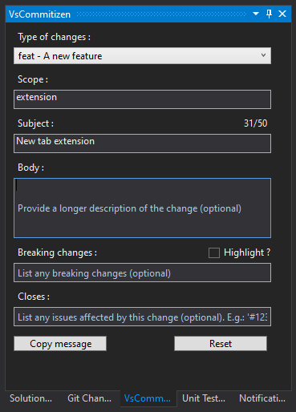
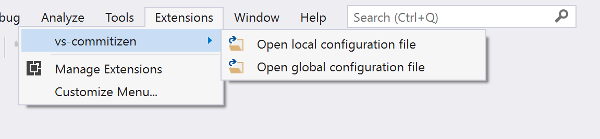

# vs-commitizen

[](https://ci.appveyor.com/project/MrLuje/vs-commitizen/branch/master)

This extension adds [commitizen](https://github.com/commitizen/) support to VisualStudio.

(If you are still using "classic git experience" or VisualStudio 2015/2017, you can use the [previous integration](./old-git.md))

## Features

A nice page to format your comment using commitizen fashion (available under **View > Other windows > VsCommitizen**)



- Nice page to format your comment using commitizen fashion.


## Customizations

The list of "Type of changes" can be customized, globally or per repository.

The configuration is stored in a *.commitizen.json* file ([schema](./config-schema.json))

You can access the configuration file directly from VisualStudio menu (files will be generated if not existing yet) :




#### Sample configuration

```json
{
  "$schema": "https://github.com/MrLuje/vs-commitizen/config-schema.json",
  "types": [
    {
      "type": "feat",
      "description": "A new feature"
    },
    {
      "type": "fix",
      "description": "A bug fix"
    },
    {
      "type": "docs",
      "description": "Documentation only changes"
    },
    {
      "type": "test",
      "description": "Adding missing tests or correcting existing tests"
    }
}
```

## Build from source

- Install paket
```bash
dotnet tool install --global Paket
```
- Restore nugets dependencies
```bash
paket restore
```
- Compile with VisualStudio

### Build issues

```
Could not load file or assembly 'System.Runtime, Version=4.1.2.0, Culture=neutral, PublicKeyToken=b03f5f7f11d50a3a' or one of its dependencies. The system cannot find the file specified.
```
- Check that file *vs-commitizen.Tests\app.config* contains the following redirect 
```xml
<dependentAssembly>
    <Paket>True</Paket>
    <assemblyIdentity name="System.Runtime" publicKeyToken="b03f5f7f11d50a3a" culture="neutral" />
    <bindingRedirect oldVersion="0.0.0.0-65535.65535.65535.65535" newVersion="4.0.0.0" />
</dependentAssembly>
```