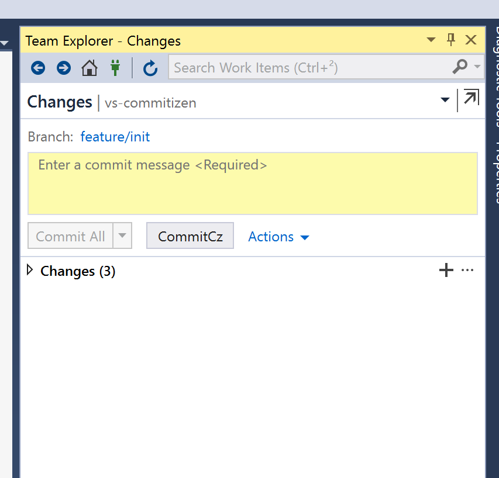

# vs-commitizen

[](https://ci.appveyor.com/project/MrLuje/vs-commitizen/branch/master)

This extension adds [commitizen](https://github.com/commitizen/) support to VisualStudio.

## Features

- Add link in _Source control_ menu and _Home_ view


- Add button near to the "Commit" button in _Changes_ view to easily use commitizen



- Nice page to format your comment using commitizen fashion.


## Customizations

The list of "Type of changes" can be customized, globally or per repository.

The configuration is stored in a *.commitizen.json* file ([schema](./config-schema.json))

You can access the configuration file directly from VisualStudio menu (files will be generated if not existing yet) :


#### Sample configuration

```json
{
  "$schema": "https://github.com/MrLuje/vs-commitizen/config-schema.json",
  "types": [
    {
      "type": "feat",
      "description": "A new feature"
    },
    {
      "type": "fix",
      "description": "A bug fix"
    },
    {
      "type": "docs",
      "description": "Documentation only changes"
    },
    {
      "type": "test",
      "description": "Adding missing tests or correcting existing tests"
    }
}
```